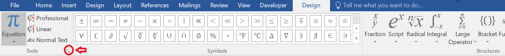

# MathML formatter
Takes in a line-separated list of side-by-side variables in the MathML document and groups instances of them together appropriately. By default, when copying variables from word, word does not recognize when a group of characters represents a single variable; each character is placed in its own separate &lt;mi>, &lt;mo>, or &lt;mn> tag and treated as a separate variable. This tool tries to join them together where appropriate using a user-supplied variable list.

[HTML page of tool here.](https://commwebteam.github.io/mathml_formatter/mathml.html)

It also does some basic formatting of the MathML code pasted from word, including:
- removing "mml:" in the tags
- removing extra attributes in the &lt;math> tags
- replacing any variables consisting solely of a space with mspace

If the option is checked, it also removes the *mathvariant="normal"* attribute (this formatting usually happens when you copy text from elsewhere in the Word document into an equation).

This tool assumes consistent space encoding (dealt with in the [general Dreamweaver paste formatting tool](https://commwebteam.github.io/gen_dw_format/dreamweaver_paste_formatter/dw_paste_format.html)).

## Variable list formatting
The list of side-by-side variables should be line-separated. Each line should consist of the variable name(s), followed by a space and then a single character of v, f, m, c, or a.

The single character indicates how the variable(s) should be treated:
- v (variable) indicates that the string consists of a single multi-character variable.
- f (function) indicates that the string consists of a single multi-character function.
- m (multiplication) indicates that the string consists of individual single-character variables multiplied together.
- c (comma) indicates that the string consists of individual single-character variables listed side-by-side.
- a (acronym) indicates that the string consists of a single multi-character acronym. These are currently treated identically to regular multi-character variables (v).

For v, f, and a, consecutive &lt;mi> tags that each contain a character in the string are joined together. The tool also checks for a specific edge case where the final character in the string is part of a superscript of subscript tag.

For f, &amp;af; is also added after the function.

For m and c, &amp;it; and &amp;ic; are respectively added between each character.

### Example list

Suppose we have math indicating the following equation:

max(alpha) = ab - cij

Which states that [the maximum of alpha] is equal to [(a multiplied by b) minus (c subscript ij)], where i indicates row and j indicates column.

We can see that
- max is a function.
- alpha is a variable.
- ab consists of two variables being multiplied against each other.
- ij consists of two variables listed side-by-side.

So the list would consist of
- max f
- alpha v
- ab m
- ij c

and the MathML would look like so:

&lt;math>&lt;mrow>&lt;mrow>&lt;mi>max&lt;/mi>&lt;mo>&amp;af;&lt;/mo>&lt;/mrow>&lt;mo>⁡&lt;/mo>&lt;mrow>&lt;mfenced separators="|">&lt;mrow>&lt;mi>alpha&lt;/mi>&lt;/mrow>&lt;/mfenced>&lt;/mrow>&lt;/mrow>&lt;mo>=&lt;/mo>&lt;msub>&lt;mrow>&lt;mi>c&lt;/mi>&lt;/mrow>&lt;mrow>&lt;mi>i&lt;/mi>&lt;mo>&amp;ic;&lt;/mo>&lt;mi>j&lt;/mi>&lt;/mrow>&lt;/msub>&lt;/math>

### Variable list priority

Variables/functions/acronyms are checked after multiplication/commas. This is find if a multicharacter variable is multiplied by another variable. Within these two groups, strings are sorted by length in descending order.

#### Example
Given the following list:

*ab f*

*cde v*

*cdef m*

This will be sorted into

*cdef m*

*cde v*

*ab f*

1. &it will be inserted between all &lt;mi> tags that consecutive contain c, then d, then e, then f.
2. All consecutive mi tags containing c, then d, then e (including those that have &it between) are joined into &lt;mi>cde&lt;/mi>. 
3. All consecutive mi tags containing a then b are joined into &lt;mi>ab&lt;/mi> and are followed by &af.

## Summation formatting
If the option is checked, the tool will also attempt to adjust summations that have top/bottom values so that their text is above/below the summation symbol rather than to the right. It also adds padding around &lt;munder&gt; and &lt;munderover&gt;.

The current padding added around rows is
- height="+2ex" voffset="1ex" for the summation itself;
- lspace="-0.7em" voffset="-1ex" for the bottom value of a summation;
- lspace="-0.7em" voffset="1ex" for the top value of a summation.

You can adjust these values in the format_summations() function in mathml_helpers.js.

The tool searches for summations using the keyword *&lt;mo&gt; stretchy="false"*, then looks for the next mrow tags that have the same indentation as the keyword to add the padding around. Since it matches opening and closing tags based on them having the same indentation, it requires proper HTML indentation (you can apply this in Dreamweaver through Edit -> Code -> Apply Source Formatting).

# Working with MathML when converting Word documents

## Copying equations in Word as MathML instead of linear formatting

You can copy equations from Word as MathML code instead of the default linear formatting option through the following steps:

1. Click on any equation in the Word document.
2. In the "Design" tab of the ribbon, go to Equation Options (the arrow at the bottom right of the "Tools" section):

3. Select "Copy MathML to the clipboard as plain text".

## Getting math in a Word document

Since copying an entire Word document will copy the equations in linear format instead of MathML, even if the above option is selected, the VBA macro in our [macro repository](https://github.com/CommWebTeam/vba) copies the math out of the equations as MathML, and then pastes them back into the document at the same location. You can then copy the entire Word document into Dreamweaver with the MathML intact.

After doing so, since the MathML tags are read as text, the brackets will be pasted as their html entities (e.g. &lt;math> will be pasted as &amp;lt;math&amp;gt;). You can fix this using one of the checks in the [general Dreamweaver paste formatting tool](https://commwebteam.github.io/gen_dw_format/dreamweaver_paste_formatter/dw_paste_format.html).

## Visually inspecting MathML equations for correctness

Since math equations in an HTML document aren't easily Beyond Compared, you will have to go through them one by one to visually inspect them for correctness compared to their Word counterparts.

Don't forget that you can search for equations in a Word document using the Cambria Math font (in Word's advanced find, click "More >>" -> "Format" -> "Font" and select Cambria Math).

I also wrote a quick tool to extract any lines that have math chunks from an HTML document, along with their line numbers and surrounding lines for context. I figured this would be helpful to more easily scan through math equations and check for errors.

[HTML document here.](get_math/get_math.html)
